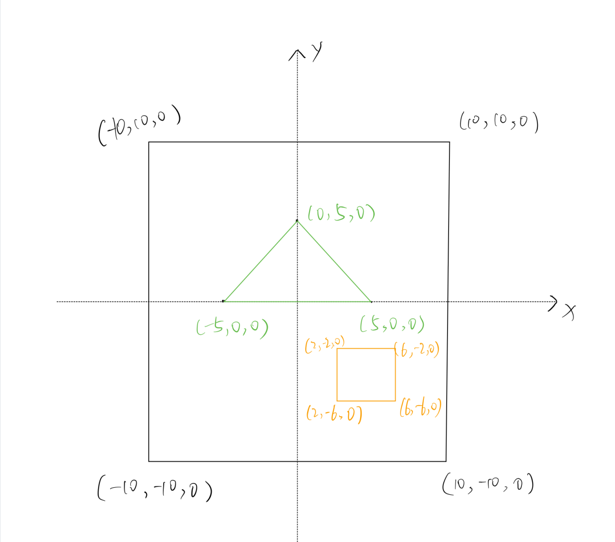
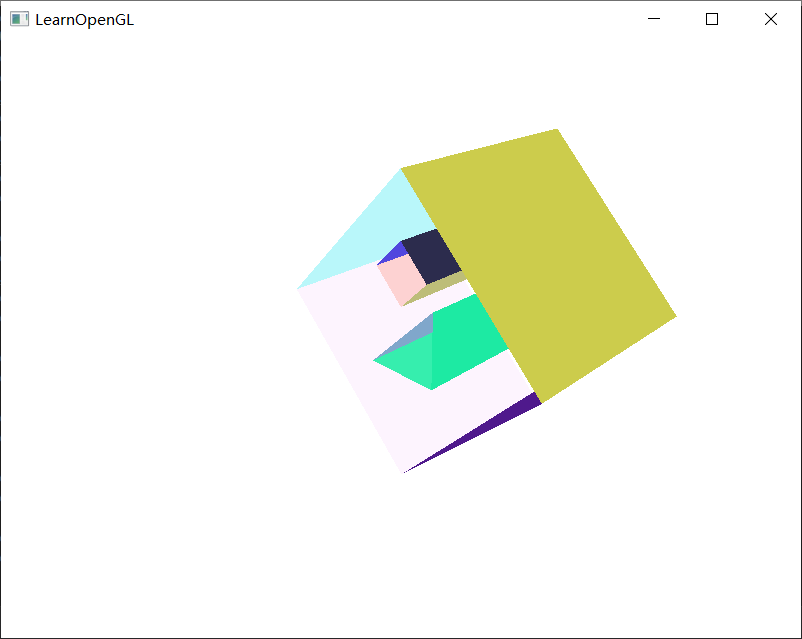
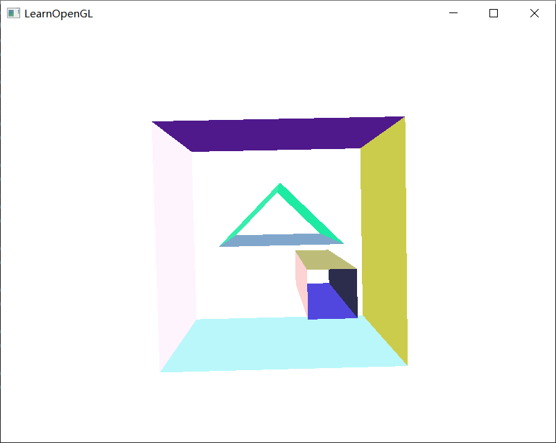

## 三维CAD建模课程作业  

### 任务  

1. 定义半边数据结构；  
2. 基于半边数据结构，实现五个欧拉操作；  
3. 基于欧拉操作，实现扫掠操作，并将基于扫掠操作构建的实体模型进行图形显示。  

### 环境    

visual studio 2019 + glfw + glad  + glm，使用opengl3.3。  

### 项目结构  

```
hello_opengl-master
├─ hello_opengl
│    ├─ Camera.h
│    ├─ Draw.h
│    ├─ EulerOperation.cpp
│    ├─ EulerOperation.h
│    ├─ HalfEdgeDataStructure.h
│    ├─ Shader.h
│    ├─ Sweep.cpp
│    ├─ Sweep.h
│    ├─ hello_opengl.vcxproj
│    ├─ hello_opengl.vcxproj.filters
│    ├─ in.txt
│    ├─ main.cpp
│    ├─ shader.fs
│    └─ shader.vs
├─ hello_opengl.sln
├─ opengl
├─ pic
└─ readme.md
```

图形相关的文件  

```
// 绘制的主要文件
Draw.h
// 处理视角的类
Camera.h
// 着色器
Shader.h
shader.fs
shader.vs
// opengl相关的库
opengl文件夹
```

数据结构与算法相关的文件  

```
// 半边数据结构
HalfEdgeDataStructure.h
// 欧拉操作
EulerOperation.cpp
EulerOperation.h
// 扫成操作
Sweep.cpp
Sweep.h
```

其他文件  

```
// 程序入口
main.cpp
// 数据输入
in.txt
// 项目说明
pic
readme.md
```


### 输入    

- 文件`hello_opengl/in.txt`为输入，格式为：第1行为1个整数n，表示底面一共有n个环（包括外环和所有内环）；  
- 然后输入n个环的数据，每个环的数据格式为：第1行为1个整数m，表示该环有m个顶点，之后的m行按逆时针（俯视角）顺序每行输入1个点的坐标（浮点数），x、y、z坐标以空格分隔；  
- 输入所有点的坐标之后另起一行，输入扫成的向量。  

示例  

```txt
3
4
-10.0 10.0 0.0
-10.0 -10.0 0.0
10.0 -10.0 0.0
10.0 10.0 0.0
3
0.0 5.0 0.0
-5.0 0.0 0.0
5.0 0.0 0.0
4
2.0 -2.0 0.0
2.0 -6.0 0.0
6.0 -6.0 0.0
6.0 -2.0 0.0
0.0 0.0 20.0
```

对应的底面如下，扫成方向和距离为沿z轴正方向扫成20个单位：  



### 输出     

控制台输出为扫成构造的实体的所有表面及其中的环、组成环的坐标，环中点的输出顺序即为环的方向。  

图形输出为扫成构造的实体，因为没有解决带孔多边形的绘制，所以底面和顶面没有绘制。绘制出的实体会不断旋转，使用按键`W`、`A`、`S`、`D`可以改变视角。  

示例  

输入示例对应的命令行输出为：  

```
face[0]
face[0] -> loop[0]
[-10, -10, 0]  [-10, 10, 0]  [10, 10, 0]  [10, -10, 0]
face[0] -> loop[1]
[0, 5, 0]  [-5, 0, 0]  [5, 0, 0]
face[0] -> loop[2]
[2, -2, 0]  [2, -6, 0]  [6, -6, 0]  [6, -2, 0]
face[1]
face[1] -> loop[0]
[10, -10, 20]  [10, 10, 20]  [-10, 10, 20]  [-10, -10, 20]
face[1] -> loop[1]
[-5, 0, 20]  [0, 5, 20]  [5, 0, 20]
face[1] -> loop[2]
[2, -6, 20]  [2, -2, 20]  [6, -2, 20]  [6, -6, 20]
face[2]
face[2] -> loop[0]
[-10, 10, 20]  [10, 10, 20]  [10, 10, 0]  [-10, 10, 0]
face[3]
face[3] -> loop[0]
[-10, -10, 20]  [-10, 10, 20]  [-10, 10, 0]  [-10, -10, 0]
face[4]
face[4] -> loop[0]
[10, -10, 20]  [-10, -10, 20]  [-10, -10, 0]  [10, -10, 0]
face[5]
face[5] -> loop[0]
[10, 10, 20]  [10, -10, 20]  [10, -10, 0]  [10, 10, 0]
face[6]
face[6] -> loop[0]
[5, 0, 20]  [0, 5, 20]  [0, 5, 0]  [5, 0, 0]
face[7]
face[7] -> loop[0]
[-5, 0, 20]  [5, 0, 20]  [5, 0, 0]  [-5, 0, 0]
face[8]
face[8] -> loop[0]
[0, 5, 20]  [-5, 0, 20]  [-5, 0, 0]  [0, 5, 0]
face[9]
face[9] -> loop[0]
[6, -2, 20]  [2, -2, 20]  [2, -2, 0]  [6, -2, 0]
face[10]
face[10] -> loop[0]
[6, -6, 20]  [6, -2, 20]  [6, -2, 0]  [6, -6, 0]
face[11]
face[11] -> loop[0]
[2, -6, 20]  [6, -6, 20]  [6, -6, 0]  [2, -6, 0]
face[12]
face[12] -> loop[0]
[2, -2, 20]  [2, -6, 20]  [2, -6, 0]  [2, -2, 0]
```

图形输出为：  

[这里](https://www.bilibili.com/video/BV1GK41137f4)可以通过视频看到效果。  

效果截图  





问题与局限：  

- 对于面的法向问题，环的走向决定面的法向。但是不太明白面的法向发挥了什么作用，在绘制时并没有用到。  
- 目前只能绘制凸多边形，问题在于绘制而非算法，算法是可以扫成任意的多边形的，但是凹多边形和带孔多变形的绘制问题还没有解决。  